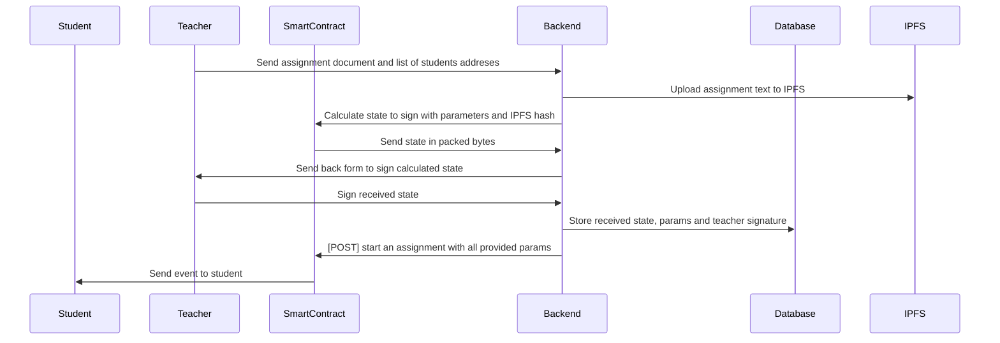
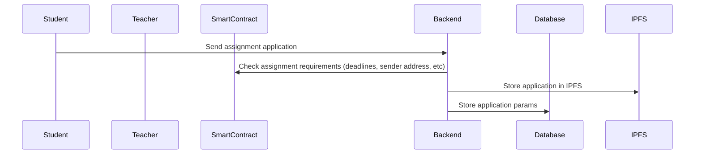
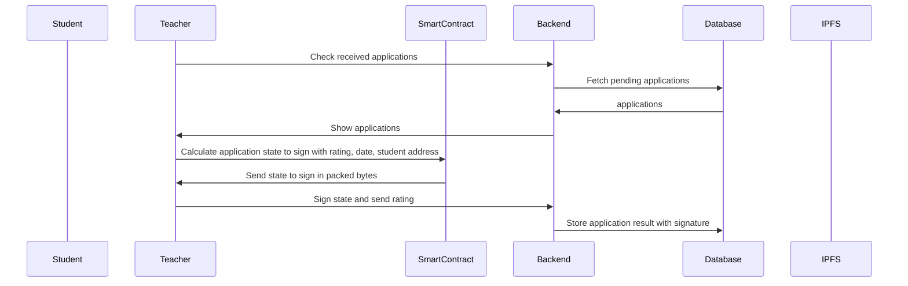
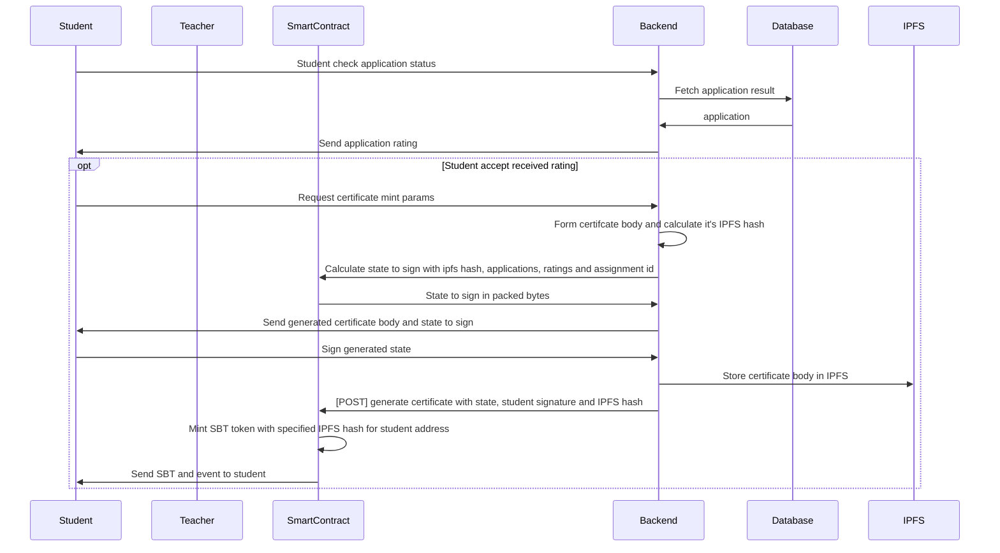

# Web3 based Learning Management System (LMS)

LMS goal is to incentivise online cources **creators** to create and support it's cource's assignments and **students** to buy ability to pass the assignments and mint certificates

## Tokenomic

Maybe later...

## Counterparties

- Teacher
- Students

## Functions

### Teacher

- Create course's assignment for one/many students
- Rate personal assignment reuslts

### Student

- Watch received assignments
- Send personal assignment's result for rate
- Receive ratings for each applyed assignments
- Mint assignment certificate (in case of agreement with rating)

## Technical conception

Implementation of LMS will be based on [state channel technology](https://medium.com/statechannels/state-channel-applications-1f170e7d542e), so in the whole user way any participant should post something in blockchain only 1-2 times

### Components

Our system will contain 4 key components:

- Courses smart contract
- Platform backend
- Student dApp
- Teacher dApp

#### Courses Smart contract

It will drive education process. It will provide state transitions with view functions, and mint SBT certificates. Also it should contain authorization scheme with student and teacher roles. Any state transition wil be performed after user address and role checks

#### Platform backend

It will be complete open source backend application, that will store any assignments interactions, like pending assignment applications, ratings, ...

Any interested parties should be able to deploy their own platform backend and provide education services

Also it will store all participant's state signatures and send it onchain, if needed.
It will be integration point for IPFS ecosystem with some API service (like [Pinata](https://www.pinata.cloud/))

It will post data oncahin with it's private key. Platform's private key not belongs to any teacher nor student. It will not hardcoded nor configured in smart contract

#### Student dApp

It will authenticate students via metamask, show their pending assignments with deadlines and interact with smart contract and backend

#### Teacher dApp

It will authenticate users as well as student's dApp and interact with smart-contract and backend

Certificate NFT should be implemented as [soul bound token (SBT)](https://academy.binance.com/en/articles/what-are-soulbound-tokens-sbt)

Any materails like: assignments texts, assignments applications, SBT certificates should be stored in IPFS.

Certificate should contain:

- link for assignment text
- link(s) for application(s)
- deadline date
- application(s) date(s)
- application(s) teacher signature
- application(s) student signature (optional)
- student certificate signature
- teacher certificate signature

## Use cases

### Create course's assignment for one/many students

### Send personal assignment's result for rate

### Rate personal assignment reuslts

### Mint assignment certificate

